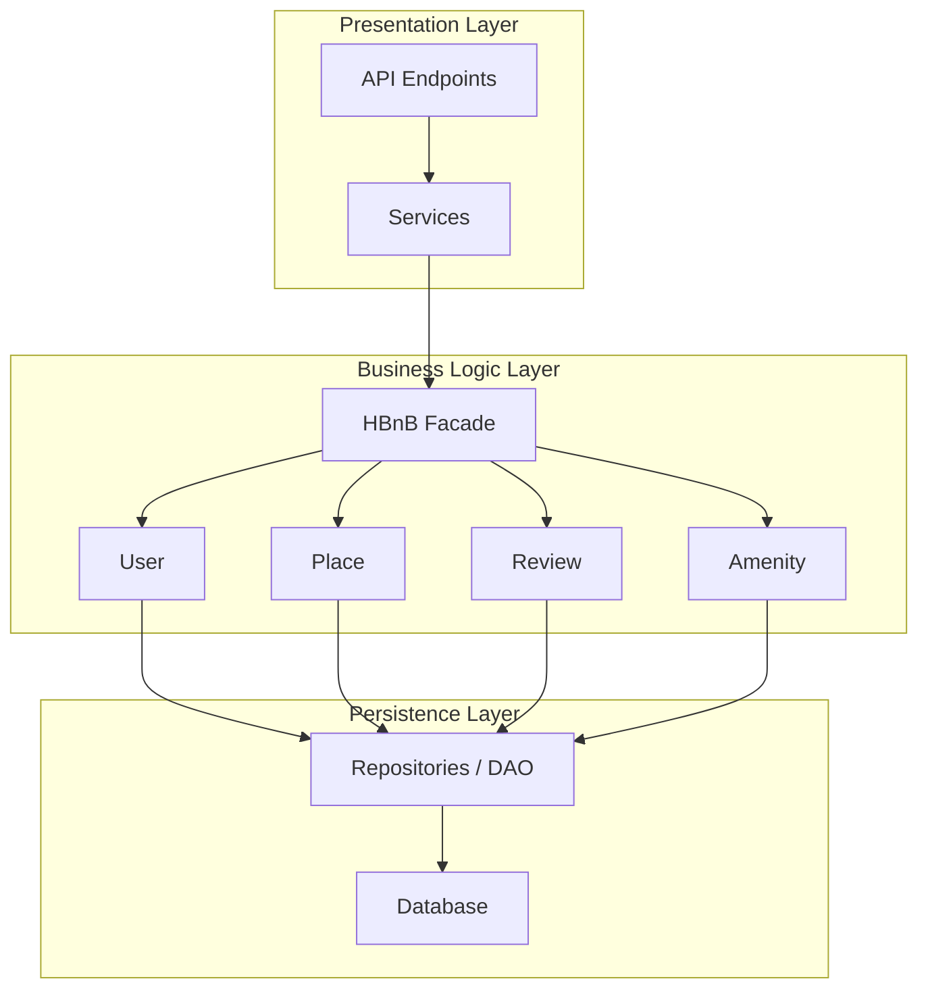
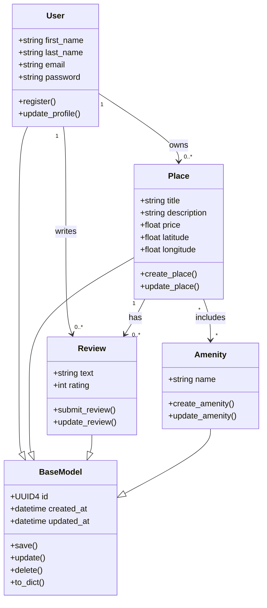

# holbertonschool-hbnb

# 0 - HBnB - High Level Package Diagram



```markdown
## Explanation

- **Presentation Layer** handles user interaction through API and services.
- **Business Logic Layer** contains core models like User, Place, Review, and Amenity.
- **Persistence Layer** manages data storage and database operations.
- **Facade Pattern** simplifies communication between layers by providing a unified interface.
```

# 1 - HBnB - Detailed Class Diagram



```markdown
## Explanation

- BaseModel
- User
- Place
- Review
- Amenity
- inheritance
- associations
- multiplicity
```
