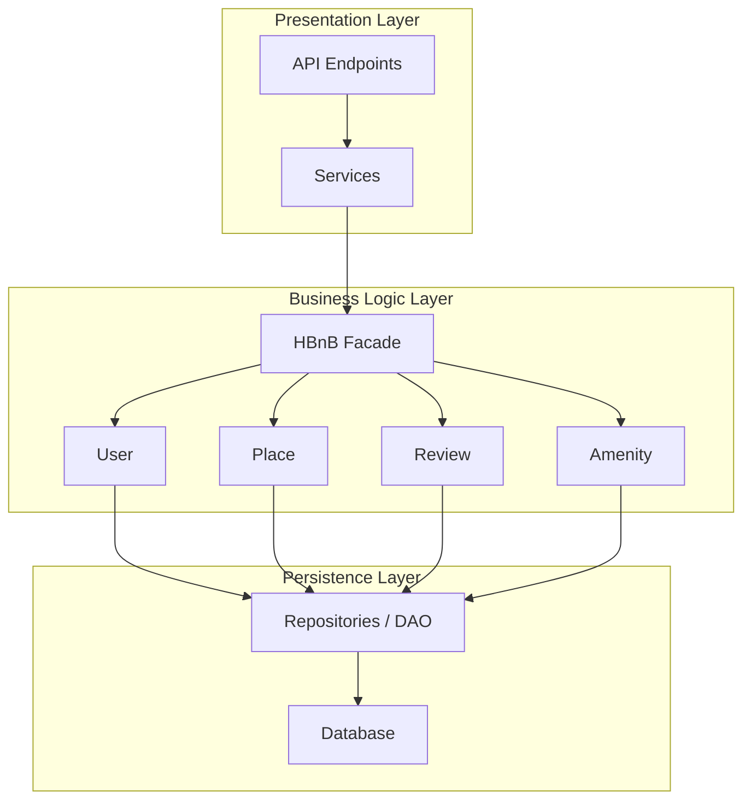
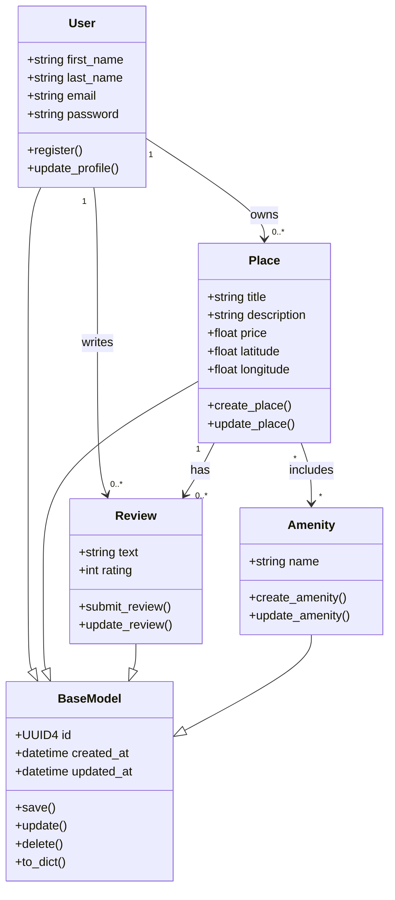
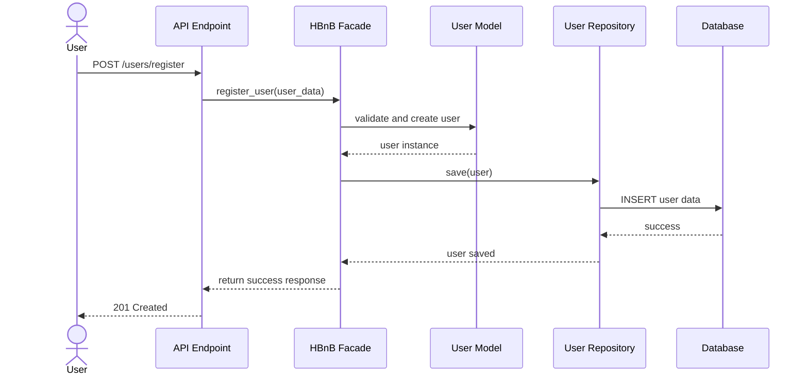
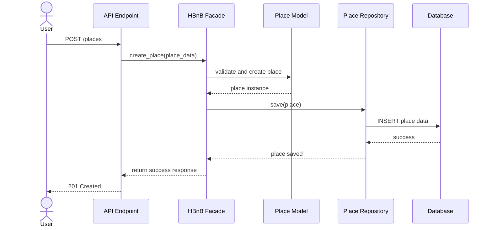
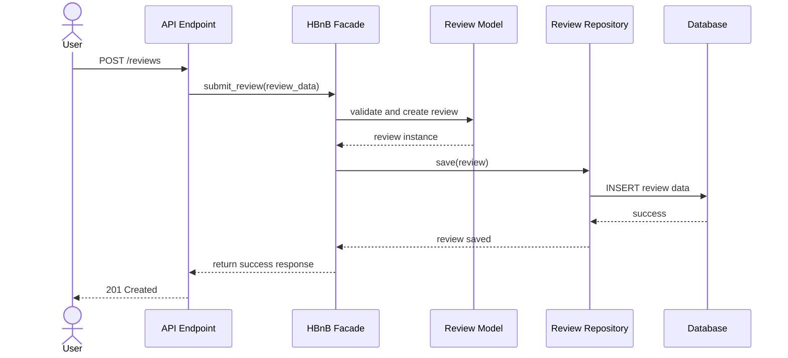
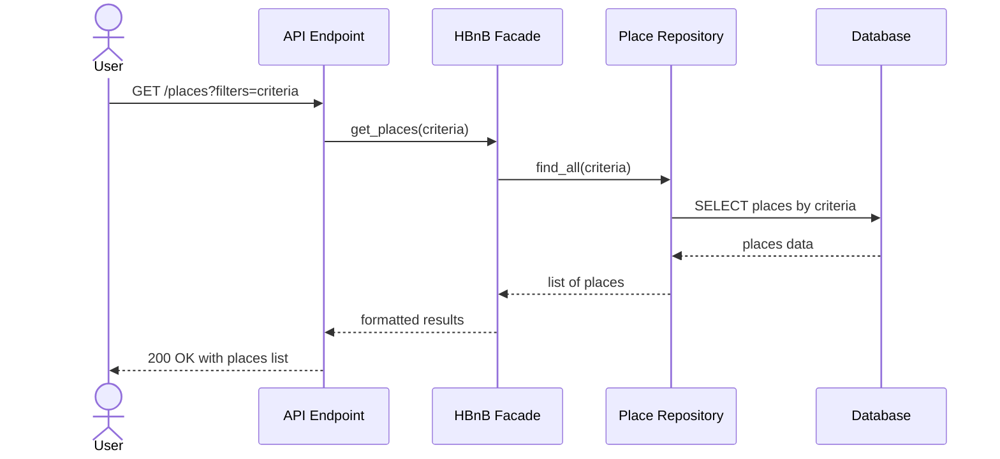

# holbertonschool-hbnb

# 0 - HBnB - High Level Package Diagram



```markdown
## Explanation

- **Presentation Layer** handles user interaction through API and services.
- **Business Logic Layer** contains core models like User, Place, Review, and Amenity.
- **Persistence Layer** manages data storage and database operations.
- **Facade Pattern** simplifies communication between layers by providing a unified interface.
```

# 1 - HBnB - Detailed Class Diagram



```markdown
## Explanation

- BaseModel
- User
- Place
- Review
- Amenity
- inheritance
- associations
- multiplicity
```

## 2. Sequence Diagrams for API Calls

This section presents four sequence diagrams that illustrate how different layers of the HBnB application interact to process API requests.  
Each diagram shows the communication flow between the **Presentation Layer**, **Business Logic Layer**, and **Persistence Layer**.

---

### 2.1 User Registration



```markdown
##Explanation

This sequence diagram shows how a new user account is created in the system.

The user sends a registration request to the API.
The API forwards the request to the facade.
The facade validates the input and creates a new User object.
The user data is then saved through the repository into the database.
Finally, a success response is returned to the client.
```

### 2.2 Place Creation



```markdown
##Explanation

This diagram represents the process of creating a new place listing.

The user submits place data through the API.
The API passes the request to the facade.
The facade applies business rules and creates a Place object.
The place is persisted using the repository and stored in the database.
The API returns a confirmation response.
```

### 2.3 Review Submission



```markdown
##Explanation

This sequence diagram shows how a user submits a review for a place.

The user sends review information to the API.
The API forwards the request to the facade.
The facade validates the request and creates a Review object.
The review is stored in the database through the repository.
A success response is then returned.
```

### 2.4 Fetching a List of Places



```markdown
##Explanation

This diagram illustrates how the system retrieves a list of places based on user-defined criteria.

The user sends a request to fetch places.
The API sends the request to the facade.
The facade delegates the search to the repository.
The repository queries the database and returns matching results.
The response is formatted and sent back to the user.
```
